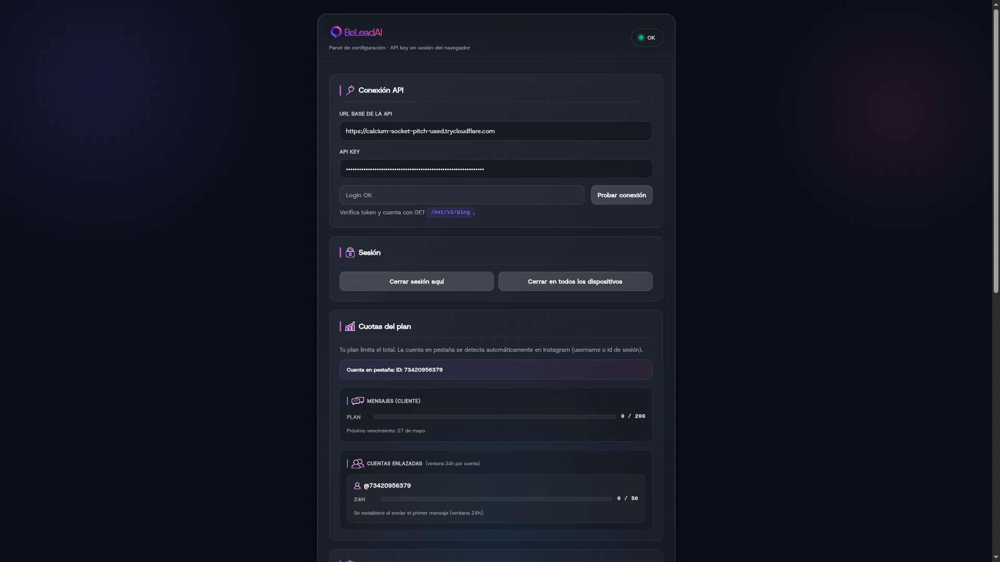
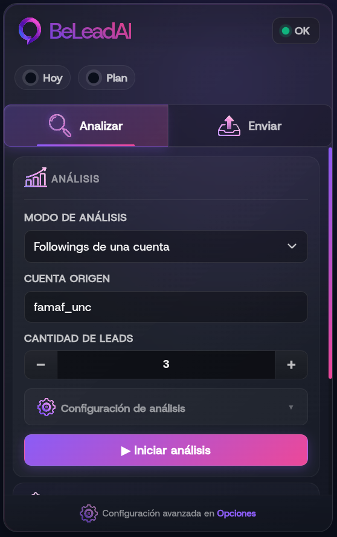
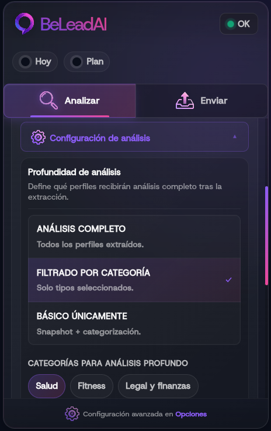
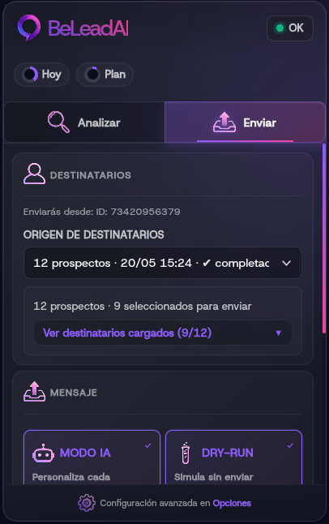
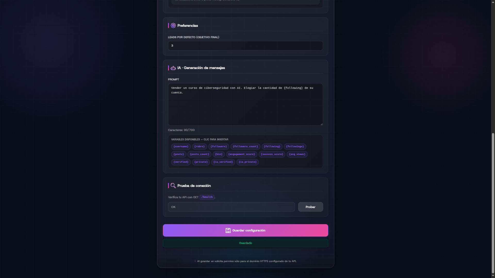
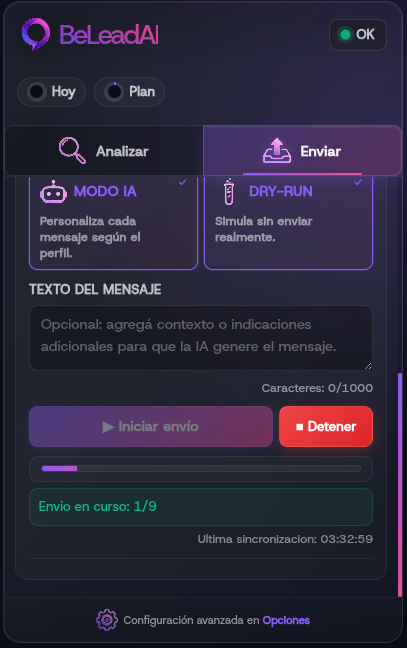

BeLeadAI es una plataforma de prospección comercial que combina backend, automatización y una extensión Chrome MV3. El producto permite convertir Instagram en una fuente de leads: extrae audiencias desde cuentas objetivo, analiza perfiles, selecciona destinatarios y encola campañas de mensajes desde el navegador del usuario.

La parte visible es una extensión simple de usar, pero por debajo hay un sistema backend con jobs, colas, límites, contratos de API, WebSockets, versionado, distribución y observabilidad.

El sistema está dividido en dos piezas principales: un backend privado que controla análisis, cuotas, estado y ejecución; y una extensión Chrome instalada por el usuario, que actúa como cliente operativo conectado a la API.

## Casos de uso principales

BeLeadAI cubre un flujo completo de prospección:

- Configuración de la extensión mediante API Base URL HTTPS y API key.
- Validación de conexión contra una API privada.
- Extracción de audiencias desde cuentas objetivo.
- Análisis de perfiles con distintos niveles de profundidad.
- Selección de destinatarios y deduplicación de contactos.
- Configuración de mensajes manuales o asistidos por IA.
- Encolado de campañas desde la extensión instalada.
- Seguimiento de jobs, progreso, errores, límites y resultados.

El enfoque de producto fue mantener una interfaz simple para el usuario, pero con una arquitectura suficientemente robusta para controlar estado, límites, versionado y comunicación con backend.

> Las capturas usan datos ficticios cargados únicamente para mostrar los casos de uso del sistema.

## Capturas del producto

### Configuración de API y límites



La extensión parte de una configuración explícita: URL HTTPS de la API privada, API key y prueba de conexión. Desde la misma experiencia el usuario puede revisar límites de uso, estado de cuenta y capacidad disponible antes de iniciar una campaña.

### Panel de análisis de leads



El panel de análisis muestra resultados generados desde audiencias objetivo. La intención es transformar una extracción cruda de perfiles en una lista accionable, con estado, métricas y contexto suficiente para decidir a quién contactar.

### Profundidad de análisis



El usuario puede ajustar el costo y la precisión del análisis. El modo básico prioriza velocidad; el modo profundo permite enriquecer la evaluación cuando se necesita más contexto o cuando el flujo apunta a rubros específicos.

## Análisis profundo de perfiles

El análisis profundo no se limita a leer nombre y biografía. El backend construye un snapshot del perfil y, cuando corresponde, navega a la sección de reels para extraer métricas recientes.

Datos extraídos o derivados:

- `username`: identificador normalizado del perfil.
- `bio`: descripción pública del perfil.
- `category_text`: categoría profesional visible cuando Instagram la expone.
- `followers`: cantidad de seguidores.
- `followings`: cantidad de cuentas seguidas.
- `posts`: cantidad de publicaciones.
- `privacy`: estado público, privado o desconocido.
- `is_verified`: verificación del perfil cuando está disponible.
- `rubro`: categoría de negocio detectada.
- `avg_views_last_n`: promedio de views sobre los últimos reels analizados.
- `avg_likes_last_n`: promedio de likes sobre los últimos reels analizados.
- `avg_comments_last_n`: promedio de comentarios sobre los últimos reels analizados.
- `reel_upload_frequency`: frecuencia estimada de publicación de reels.
- `engagement_score`: calidad de interacción normalizada.
- `success_score`: score agregado de potencial comercial.
- `consistency_score`: en la implementación actual representa principalmente frecuencia contra benchmark.
- `analysis_depth`: `basic` o `deep`, según si se pudo completar el análisis con métricas de reels.

La detección de rubro sigue una estrategia de prioridad:

- Primero intenta usar la categoría profesional de Instagram si hay una coincidencia normalizada contra categorías conocidas.
- Si no hay categoría útil, analiza la biografía con keywords fuertes y débiles.
- Las keywords fuertes pesan `2`, las débiles pesan `1`.
- Un rubro califica si llega al score mínimo o si tiene al menos una coincidencia fuerte.
- Si dos rubros empatan con la misma fuerza, se evita clasificar para no introducir falsos positivos.

El cálculo de métricas profundas parte de los reels:

```text
avg_views = promedio(views de reels recientes)
avg_likes = promedio(likes de reels recientes)
avg_comments = promedio(comments de reels recientes)
```

El `engagement_score` mezcla dos señales:

```text
er_views = (avg_likes + 3 * avg_comments) / avg_views
er_followers = (avg_likes + avg_comments) / followers
```

Los comentarios pesan más que los likes porque son una señal de interacción más costosa. Cada ratio se compara contra benchmarks y se transforma con una función logística para evitar scores lineales frágiles o valores pegados a `1.0`.

El `success_score` combina:

- `engagement_score`: peso `0.5`.
- `views_score`: peso `0.3`, calculado desde `avg_views / followers` contra benchmark por tamaño de cuenta.
- `frequency_score`: peso `0.2`, calculado desde la frecuencia de reels contra benchmark.

Cuando no hay frecuencia disponible, el score redistribuye el peso entre engagement y views. Además, los scores se penalizan si la muestra de reels es chica: con menos reels analizados hay menos confianza estadística, entonces el resultado baja proporcionalmente hasta alcanzar el objetivo de muestra configurado.

## Aprendizajes de scraping

El scraping de Instagram fue la parte más inestable del producto. La dificultad principal no fue “leer HTML”, sino diseñar una automatización que sobreviva a cambios de DOM, timeouts, sesiones, perfiles privados, modales con scroll interno, datos parcialmente disponibles, heurísticas anti-bot y diferencias entre cuentas.

El trabajo combinó varias capas de investigación:

- Automatización visible con Selenium para navegar como usuario real.
- Lectura del DOM cuando la información estaba renderizada de forma confiable.
- Observación de Network en DevTools para entender qué requests alimentaban ciertas vistas.
- Ingeniería inversa exploratoria de payloads y respuestas para validar si un dato venía del HTML, del estado interno de la app o de una llamada posterior.
- Comparación entre perfiles públicos, privados, inexistentes, con pocos datos y con mucho contenido.
- Ajustes iterativos cuando Instagram cambiaba estructura de nodos, atributos, modales o timings.

Aprendizajes técnicos concretos:

- Separar scraping en un puerto de dominio (`BrowserPort`) permitió cambiar o endurecer el adaptador Selenium sin contaminar casos de uso.
- Conviene tratar cada extracción como una operación incierta: un perfil puede no cargar, estar privado, no tener reels, mostrar métricas incompletas o cambiar el markup.
- Para followings, el sistema navega al perfil, abre el modal, hace scroll de forma incremental, deduplica nombres de usuario y corta por límite, falta de crecimiento o estabilidad del final.
- Para análisis profundo, el sistema navega a reels, extrae métricas por pieza y calcula promedios solo con datos disponibles.
- Los errores de navegador necesitan clasificación: navegación, DOM, autenticación, rate limit, conexión y errores inesperados no se tratan igual.
- Las capturas de depuración y los logs por fase son claves para entender fallos que no se pueden reproducir solo con trazas de error.
- La afinidad por cuenta evita mezclar sesiones de Instagram entre trabajos y reduce errores difíciles de rastrear.
- El reciclado de drivers y los límites de concurrencia importan tanto como el código de scraping: Chrome consume memoria, puede quedar en estado inválido y necesita supervisión.
- El sistema debe aceptar resultados parciales. Un análisis básico útil es mejor que fallar todo porque no se pudieron leer reels.

### Selenium y comportamiento de usuario

Selenium fue útil porque permite operar sobre Instagram como lo haría una persona: abrir perfiles, entrar a secciones, esperar renderizados, hacer scroll en modales, leer elementos visibles y mantener una sesión de navegador. Pero usar Selenium de forma ingenua no alcanza.

Los problemas reales aparecen en los bordes:

- El DOM puede existir antes de que los datos estén completos.
- Un selector puede funcionar para una cuenta y fallar en otra por idioma, layout, experimentos A/B o estado de sesión.
- Los modales de followings tienen scroll interno y carga incremental; no basta con leer una lista inicial.
- Algunos elementos se reciclan virtualmente, por lo que hay que deduplicar usernames y detectar falta de crecimiento.
- El navegador puede quedar en una pantalla intermedia, login wall, challenge o error silencioso.
- Los tiempos fijos son frágiles: conviene combinar esperas explícitas, detección de estado y cortes por estabilidad.

La estrategia terminó siendo defensiva: navegar, validar que el perfil cargó, distinguir privado/inexistente, abrir el modal correcto, hacer scroll por ciclos, recolectar nombres de usuario, normalizar, deduplicar y cortar cuando se alcanza el límite o cuando el contenido deja de crecer.

### Por qué Selenium y no solo scrapers HTTP

Evalué el problema como una aplicación web dinámica, no como una página estática. Instagram no entrega una vista simple donde todo el dato esté en HTML inicial: muchas partes dependen de JavaScript, estado de sesión, navegación cliente, lazy loading, modales, scroll incremental y respuestas asincrónicas. Por eso un scraper basado solo en `requests` o parsing HTML queda corto rápidamente.

Selenium permitió trabajar con el navegador real como runtime:

- Ejecuta el JavaScript de la aplicación.
- Conserva cookies y estado de sesión de forma similar a un usuario.
- Permite observar estados intermedios de UI, no solo respuestas finales.
- Hace posible interactuar con modales, botones, rutas internas y scrolls virtualizados.
- Permite depurar visualmente con screenshots y DevTools cuando algo cambia.

También investigué herramientas del ecosistema como `undetected-chromedriver` y técnicas conocidas como `selenium-stealth`. El aprendizaje importante no fue “usar una librería mágica”, sino entender por qué existen: muchas plataformas comparan señales del navegador para diferenciar tráfico automatizado de tráfico humano.

Algunas de esas señales se suelen agrupar bajo el concepto de fingerprinting:

- Propiedades del navegador y del runtime JavaScript.
- Diferencias entre Chrome real, Chrome automatizado y navegadores headless.
- Señales de WebDriver expuestas por el entorno.
- Idioma, timezone, viewport, sistema operativo y fuentes disponibles.
- Consistencia entre cookies, sesión, IP, historial y comportamiento.
- Ritmo de navegación, repetición de acciones y patrones de scroll/click.

Instagram, como otras plataformas grandes, aplica políticas de detección y control de abuso que no dependen de una sola señal. Puede haber límites por cuenta, por IP, por endpoint, por frecuencia, por sesión o por combinación de comportamiento. Por eso la solución no podía depender únicamente de “cambiar headers” o “rotar proxies”.

La elección de Selenium tuvo sentido porque el objetivo era compatibilidad y observabilidad: ver lo que ve el usuario, entender cuándo la UI cambió y degradar el análisis si una parte no estaba disponible. Las herramientas stealth fueron útiles como referencia técnica para comprender diferencias entre navegación real y automatizada, pero el diseño del producto se apoyó más en límites, sesiones aisladas, backoff, jobs auditables y resultados parciales que en intentar esconder toda automatización.

### Cambios del DOM

Una parte importante del aprendizaje fue asumir que el DOM no es contrato. Instagram cambia nombres de clases, jerarquías, wrappers, textos y timing de renderizado. Por eso intenté evitar selectores demasiado acoplados a clases generadas y priorizar señales más estables: links de perfil, roles, estructura de modales y normalización de URLs.

Cuando un cambio rompía la extracción, el flujo de depuración era:

- Reproducir manualmente el caso en navegador.
- Comparar el DOM nuevo contra el DOM esperado.
- Revisar si el dato seguía renderizado o pasó a llegar por otra vía.
- Mirar Network para entender qué request alimentaba la pantalla.
- Ajustar selectores o estrategia de extracción.
- Agregar logs por fase y, cuando era necesario, capturas de depuración.

Esto cambió mi forma de ver el scraping: el selector es la última milla, no la solución completa. La solución real es tener una estrategia de observación y recuperación cuando la página cambia.

### Network e ingeniería inversa

Además del DOM, experimenté con la pestaña Network para entender cómo Instagram cargaba datos: qué llamadas se disparaban al abrir perfiles, followings, reels o acciones de navegación; qué payloads aparecían; qué información estaba disponible antes de renderizarse; y qué campos eran estables o efímeros.

Ese trabajo sirvió para:

- Confirmar si un dato visible venía de HTML renderizado o de una respuesta asincrónica.
- Entender por qué ciertas vistas tardaban en poblarse aunque el DOM ya existiera.
- Identificar diferencias entre datos públicos, datos dependientes de sesión y datos bloqueados.
- Diseñar mejores esperas: no esperar “un tiempo”, sino esperar evidencia de que la vista cargó.
- Validar límites de confiabilidad antes de convertir una observación en feature.

La ingeniería inversa fue exploratoria y de aprendizaje: no convertí cada request observado en dependencia directa. En un producto mantenible, depender de endpoints internos no documentados puede ser incluso más frágil que depender del DOM. Lo valioso fue usar Network como herramienta de diagnóstico para entender el comportamiento de la aplicación y tomar mejores decisiones de scraping.

La mayor diferencia práctica fue pasar de “buscar un selector que funcione” a “entender el flujo de datos completo”. Si una métrica aparecía tarde, podía ser por lazy loading, por un request posterior, por un estado cacheado, por un bloqueo de sesión o por una variante de UI. Mirar Network ayudó a distinguir esos casos antes de tocar código.

### Bots, sesiones y señales anti-abuso

Otro aprendizaje fue que el scraping no falla solo por errores técnicos. También falla por señales de comportamiento: demasiadas acciones, navegación repetitiva, cuentas sin historial, IPs compartidas, sesiones inestables o patrones poco humanos.

Por eso el backend no trata el scraping como una función síncrona simple. Lo rodea con controles operativos:

- Afinidad por cuenta para no mezclar sesiones ni ejecutar tareas de distintas cuentas en el mismo contexto.
- Workers aislados por cuenta para reducir contaminación de estado.
- Límites de concurrencia e inflight para no disparar demasiadas acciones simultáneas.
- Backoff y retries para no insistir agresivamente ante errores temporales.
- Cooldowns y token buckets para suavizar ritmo de ejecución.
- Clasificación de errores retryable y no retryable.
- Persistencia de estado para poder continuar, cancelar o auditar jobs.
- Heartbeats para saber si un sender sigue vivo o quedó en un estado intermedio.
- Idempotencia para no duplicar trabajos cuando una llamada se reintenta.

La extensión también cumple un rol importante: el envío de mensajes se ejecuta desde el navegador del usuario, con su sesión real, y reporta heartbeat/resultados al backend. Eso evita convertir el backend en un sender centralizado opaco y permite separar extracción/análisis server-side del envío asistido por cliente.

Esta arquitectura también hizo más fácil detectar problemas reales: API rate-limited, usuario sin sesión, cuenta incorrecta, ausencia de tareas, cooldown activo, error de navegación o fallo del content script. En vez de tener un “bot” que falla como caja negra, el sistema reporta etapas y resultados.

### Proxies y aislamiento operativo

También exploré el rol de proxies y aislamiento de navegación. En este tipo de sistemas, el proxy no es una “solución mágica”; es una pieza operativa que puede ayudar o empeorar la estabilidad según calidad, reputación, latencia y consistencia con la sesión.

Los puntos importantes fueron:

- Una cuenta debería mantener afinidad con su entorno de navegación: sesión, perfil de Chrome, cookies y red.
- Cambiar IP o proxy sin criterio puede disparar verificaciones o invalidar supuestos de sesión.
- El proxy necesita validación propia: conectividad, autenticación, latencia y ausencia de errores como `407`.
- La observabilidad debe registrar host/estado sin filtrar credenciales.
- El sistema necesita poder correr sin proxy en local y con configuración más estricta en producción.

Por eso el diseño prioriza configuración por cuenta, separación de perfiles de navegador y validaciones operativas alrededor del driver. La parte difícil no es “usar un proxy”, sino mantener coherencia entre identidad, sesión, frecuencia de acciones y entorno de ejecución.

En la práctica, el proxy se analiza como parte de una identidad operativa completa. Si la sesión, las cookies, la IP y el ritmo de acciones no son coherentes entre sí, el sistema se vuelve menos estable. Por eso preferí pensar en aislamiento y consistencia antes que en rotación agresiva.

La conclusión práctica fue que el scraping productivo necesita arquitectura alrededor: colas, retries, backoff, límites, observabilidad, persistencia, sesiones aisladas y capacidad de degradar. Sin eso, cualquier selector funcionando hoy se vuelve una deuda mañana.

### Selección de destinatarios



Los destinatarios se seleccionan desde orígenes ya procesados. El backend mantiene proyecciones de candidatos pendientes, enviados y totales para evitar duplicados y permitir que la extensión trabaje con una lista limpia.

### Configuración avanzada de prompt



El envío puede usar mensajes manuales o asistidos por IA. La configuración avanzada permite ajustar instrucciones, tono y contexto para personalizar el mensaje sin mover la lógica sensible al cliente distribuible.

### Estado de entrega de campaña



El seguimiento de campaña muestra estado de ejecución, progreso y resultados. El flujo de envío no se ejecuta como scraping server-side: la extensión mantiene el sender vivo, toma tareas y reporta resultados al backend.

## Backend

El backend está construido con Python 3.11+, FastAPI, MySQL 8 y Redis. Redis se usa para estado crítico de autenticación y rate limiting. La arquitectura operativa separa la API HTTP del dispatcher de jobs.

En Docker, la topología queda dividida en:

- `app`: API FastAPI servida con Gunicorn y UvicornWorker.
- `dispatcher`: scheduler y workers por cuenta.
- `db`: MySQL.
- `redis`: estado crítico y rate limiting.
- `db-migrate`: migraciones.

El backend expone endpoints para autenticación, configuración, límites, encolado de jobs, consulta de resultados, selección de destinatarios, pull de tareas, reporte de envíos, heartbeat, métricas y health checks.

El backend fue pensado como un sistema multi-tenant con JWT, API key, rate limiting y colas con afinidad dura por cuenta o `profile_id`. Esa afinidad evita mezclar trabajos entre cuentas y permite distribuir carga de forma controlada.

La base MySQL funciona como fuente de verdad operacional. Ahí viven clientes, planes, jobs, tasks, resultados, cuotas, idempotencia, deduplicación de destinatarios, flujos y proyecciones. Las migraciones Alembic endurecen el esquema con foreign keys, constraints, triggers y tablas específicas para cuotas y eventos.

## Colas y ejecución

Las tareas de extracción, análisis y envío se encolan desde endpoints protegidos. El backend valida API key/JWT, cuenta autorizada, payload, cuotas e idempotencia; luego registra jobs y tasks en MySQL.

Un dispatcher separado toma trabajos pendientes, los enruta por cuenta, controla concurrencia, aplica cooldowns, reclama leases expirados, reinicia workers caídos y actualiza proyecciones de resultados. Esta separación evita bloquear requests HTTP y permite aplicar límites, retries, observabilidad y control de estado.

## Extensión Chrome MV3

La extensión se distribuye como `BeLeadAI Enqueuer`, versión `0.4.0`, con Manifest V3. Usa service worker, content scripts y una página de opciones.

Permisos relevantes:

- `storage` para persistir configuración.
- `alarms` para tareas programadas.
- `tabs` y `cookies` para integración con navegador.
- `notifications` para feedback operativo.
- `host_permissions` sobre `instagram.com`.

El content script se carga en Instagram y está modularizado en selectores, observers, acciones de input, identidad de cuenta, búsqueda directa, acciones de mensajes y mensajería interna.

La configuración inicial se guarda en `chrome.storage`: API Base URL, API key y datos necesarios para conectar contra la API privada. La extensión también contempla bloqueo guiado cuando la API exige actualización del cliente mediante códigos como `CLIENT_UPDATE_REQUIRED`.

La extensión exige API sobre HTTPS. Esto evita configurar por error un backend inseguro y simplifica permisos de Chrome para host permissions externos.

## Contratos públicos

Para reducir acoplamiento entre extensión y backend, el repositorio publica contratos visibles para frontend. Estos contratos documentan las solicitudes y respuestas mínimas que la extensión necesita consumir.

La cobertura publicada incluye:

- Auth login.
- Ping.
- Config.
- Limits.
- Recipient sources.
- Recipient source recipients.
- Analyze enqueue request.
- Followings enqueue request.
- Send enqueue request.
- Send pull request/response.
- Send result request.
- Send heartbeat request.
- Send WebSocket events.
- Jobs WebSocket events.

Las respuestas siguen envoltorios estables:

```json
{ "data": { } }
```

```json
{ "error": { "code": "string", "message": "string", "details": { } } }
```

El objetivo no fue exponer toda la implementación interna, sino publicar el subconjunto estable que necesita el cliente.

## Distribución y calidad

La extensión se prepara para distribuir por GitHub Releases. Cada release publica:

- `extension-vX.Y.Z.zip`.
- `extension-vX.Y.Z.sha256`.
- `RELEASE_NOTES.md`.

El flujo de mantenimiento incluye lint, verificación de formato, tests con `node --test`, validación de contratos, smoke tests de contratos y empaquetado de release.

Scripts relevantes:

- `npm run lint`.
- `npm run format:check`.
- `npm run test`.
- `npm run check:contract`.
- `npm run pack:release`.

## Seguridad y operación

El backend depende de configuración por entorno para base de datos, secretos, Redis, CORS, HTTPS, concurrencia, transporte de colas y métricas. En producción, las métricas se protegen con bearer token y Redis es requerido para estados críticos.

La extensión se limita a publicar el cliente operativo. El backend privado concentra validación, autorización, límites y política de ejecución. También existe documentación operativa para despliegue, comandos, logs, backups y restauración.

## Resultado

BeLeadAI terminó siendo más que una extensión: es una plataforma de automatización comercial con backend privado, cliente distribuible, jobs asíncronos, límites, contratos de API, versionado, observabilidad y control operativo.

El mayor aprendizaje fue diseñar una frontera clara entre cliente y backend. La extensión debía ser simple de instalar y operar; el backend debía concentrar seguridad, cuotas, estado, ejecución de tareas sensibles y reglas de negocio.
