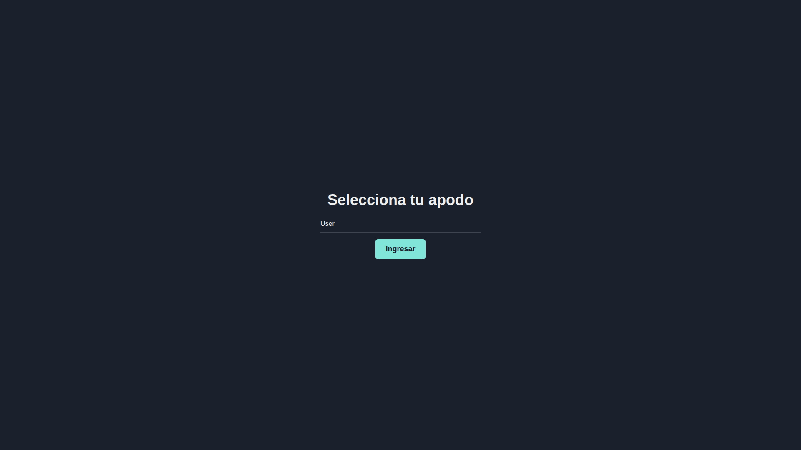
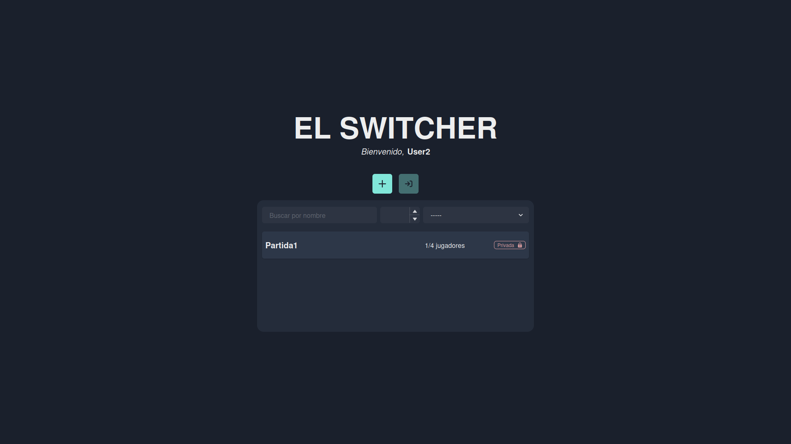
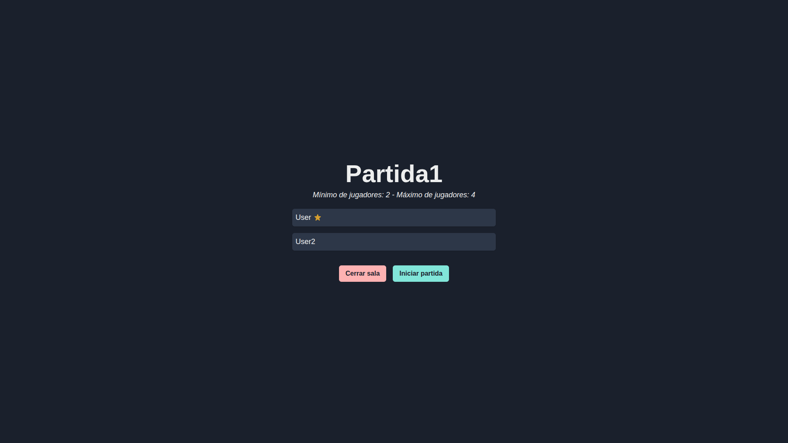
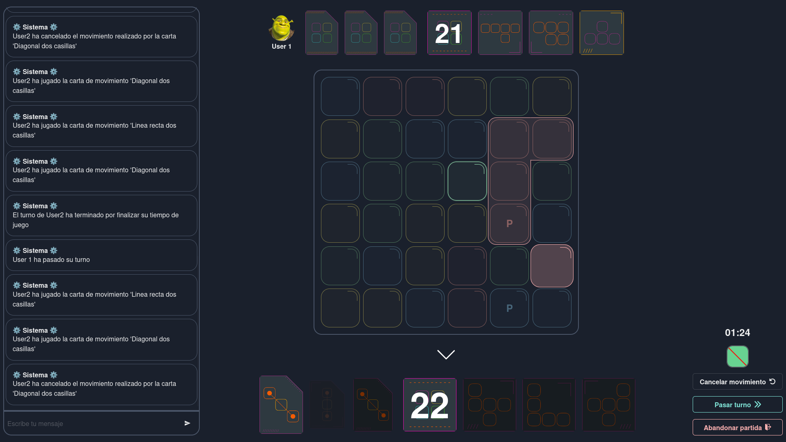
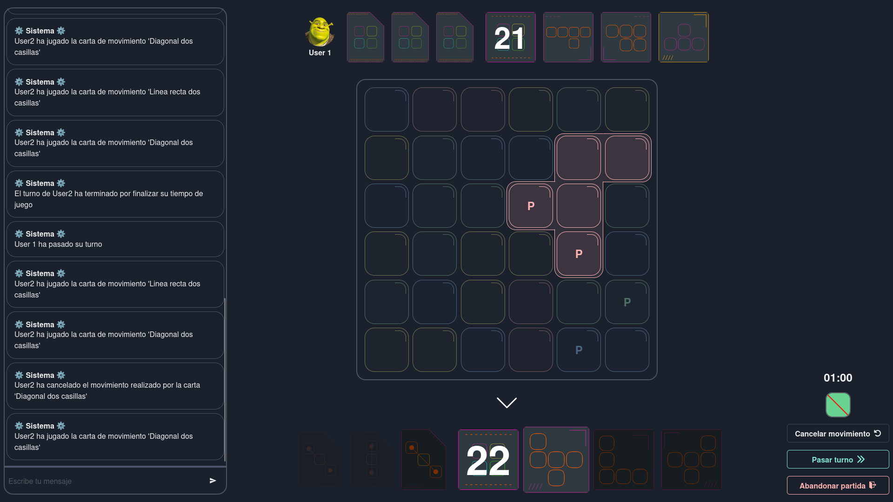

El Switcher fue una plataforma web interactiva para jugar online a un juego de mesa. El proyecto se desarrolló durante Ingeniería de Software en FAMAF, en un contexto académico que simulaba un entorno profesional con cliente, sprints, entregas, testing, revisiones y roles Scrum.

Mi participación combinó dos responsabilidades: desarrollador backend y Scrum Master durante el Sprint 2.

## Contexto del proyecto

El objetivo era replicar la experiencia del juego físico en una aplicación web multijugador. El sistema debía implementar reglas de juego, partidas, jugadores, cartas, turnos, tablero, validaciones y comunicación en tiempo real.

El equipo trabajó durante tres sprints, aproximadamente dos meses, con entregas al final de cada sprint. Cada entrega incluía demostración, análisis de cobertura y revisión con docentes/clientes responsables de los requerimientos.

Stack principal:

- Backend: FastAPI, Python, WebSockets y SQLite.
- Frontend: React y JavaScript/TypeScript.
- Testing: Pytest y Vitest.
- Gestión: Jira y Scrum.

## Casos de uso principales

El sistema cubría el flujo completo de una partida multijugador:

- Registro de jugadores y validación de nombres.
- Creación, listado e ingreso a salas públicas o privadas.
- Lobby en tiempo real con participantes, host y condiciones de inicio.
- Inicio de partida con creación automática de tablero, cartas y turnos.
- Sincronización de estado global y estado privado por WebSocket.
- Validación de acciones según turno, jugador, carta y reglas del tablero.
- Juego de cartas de movimiento y cartas de figura.
- Manejo de abandono, reconexión y finalización de partidas.
- Rechazo explícito de acciones inválidas.

## Capturas del producto

Las capturas muestran el flujo principal desde el ingreso del jugador hasta la interacción con el tablero.

### Registro de jugador

El primer paso es crear un jugador. La interfaz valida el nombre antes de habilitar el acceso al lobby, y el backend persiste el jugador para asociarlo luego a salas, partidas y conexiones WebSocket.

### Lista de partidas

El lobby muestra las salas disponibles y sus estados. Desde esta pantalla el jugador puede crear una sala, seleccionar una existente o ingresar a una sala privada si conoce la contraseña.

### Lobby de sala

Dentro de una sala, los jugadores ven la composición del grupo antes de empezar. El host puede iniciar la partida cuando se cumple el mínimo de jugadores; el resto recibe la actualización en tiempo real.

### Tablero de juego

Al iniciar, el backend crea el tablero de 36 fichas, reparte cartas y define el orden de turnos. La partida mantiene estado global para todos los jugadores y datos privados para cada mano.

### Carta de movimiento

Las cartas de movimiento permiten seleccionar fichas e intercambiarlas. El sistema controla turno, carta seleccionada, posiciones válidas y posibilidad de cancelar movimientos parciales.

### Carta de figura

Las cartas de figura requieren seleccionar un patrón válido sobre el tablero. El backend valida que la figura exista, que coincida con la carta, que no use el color prohibido y que la jugada corresponda al jugador en turno.

## Mi rol como Scrum Master

Durante el Sprint 2 facilité reuniones ágiles, planning poker, dailies, seguimiento de bloqueos y definición de tickets. El foco fue mejorar el flujo de trabajo, reducir ambigüedad y mantener criterios de aceptación claros.

Las tareas de Scrum Master incluyeron:

- Facilitar dailies y planning.
- Crear y priorizar tickets en Jira.
- Definir criterios de aceptación.
- Dar seguimiento al progreso del sprint.
- Detectar bloqueos y coordinar resolución.
- Mantener alineado el trabajo técnico con los objetivos del sprint.

Un punto importante fue que el flujo de tickets se mantuvo corto: cuando una tarea pasaba a `To Do`, avanzaba rápidamente a revisión. Esto fue posible por la claridad de tickets y por acordar la API antes de implementar.

## Contribución backend

Como desarrollador backend trabajé en funcionalidades centrales del juego y en organización del repositorio.

Tickets propios:

- Organización de la arquitectura del backend.
- Funcionalidad para abandonar partidas no iniciadas.
- Lógica para iniciar una partida.
- Sanitización y normalización de código.
- Búsqueda y validación de figuras resaltadas en el tablero.
- Manejo del color prohibido del juego.

Trabajo en pair programming:

- Creación de jugador.
- Creación de partida.
- Lógica para jugar una carta de figura.

Bugfixes:

- Cambio de color prohibido al bloquear una figura.
- Corrección de errores en cartas de figura.
- Resolución de conflictos de merge.
- Ajustes en valores esperados para endpoints de usuarios.

## Arquitectura

El backend se organizó con un enfoque de arquitectura hexagonal y vertical slicing. La intención fue separar reglas de negocio, transporte HTTP/WebSocket, persistencia y casos de uso.

Este enfoque ayudó a que las funcionalidades de juego no quedaran acopladas a detalles de FastAPI o SQLite. También facilitó probar módulos por comportamiento y mantener el código legible a medida que crecía el número de reglas.

Vertical slicing fue útil porque cada funcionalidad se podía trabajar como una unidad: endpoint o evento, validación, caso de uso, persistencia y tests asociados.

## WebSockets y experiencia multijugador

El carácter multijugador requería sincronizar estado entre clientes. FastAPI y WebSockets permitieron comunicar cambios de partidas y acciones relevantes en tiempo real.

El desafío no era solo abrir una conexión, sino mantener reglas consistentes: que una partida se pueda iniciar bajo condiciones válidas, que un jugador no realice acciones fuera de turno, que las cartas respeten reglas del tablero y que las acciones inválidas sean rechazadas de forma clara.

## Testing

El proyecto usó Pytest en backend y Vitest en frontend. En backend implementé pruebas unitarias e integración con técnica de clases de equivalencia para cubrir comportamientos válidos e inválidos.

Resultados destacados del proyecto:

- Frontend: 30 archivos de prueba.
- Frontend: 254 pruebas.
- Frontend: 83.77% de cobertura en declaraciones y líneas.
- Frontend: 87.87% de cobertura en ramas.
- Frontend: 96.42% de cobertura en funciones.
- Backend: 142 pruebas.
- Backend: 3992 líneas analizadas.
- Backend: 95% de cobertura global.

Durante el Sprint 1 hubo deuda técnica por mockear completamente la API. En el Sprint 2 ajustamos la estrategia hacia mockeo directo de base de datos para obtener pruebas más precisas y cercanas a las necesidades reales del sistema.

## Proceso de desarrollo

El proceso fue incremental. En funcionalidades con requerimientos poco claros o decisiones de base de datos, usamos pair programming para reducir incertidumbre y mejorar la calidad de las decisiones.

También trabajamos con revisión de código antes de completar tickets. Esto ayudó a resolver conflictos de merge, detectar errores de reglas y mantener consistencia en el backend.

## Resultado

El Switcher fue valioso porque combinó desarrollo técnico real con coordinación de equipo. Me permitió practicar backend con reglas de dominio, WebSockets, testing, arquitectura y liderazgo ágil en un mismo proyecto.

La principal conclusión técnica fue que, incluso en un proyecto académico, la claridad de tickets, la definición temprana de API, una arquitectura separada y una buena estrategia de pruebas tienen impacto directo en la velocidad y calidad del equipo.
