Granalia es una aplicación web desarrollada para digitalizar el circuito operativo de una empresa alimenticia. El sistema reemplaza planillas y tareas manuales por una herramienta centralizada para cargar pedidos, administrar clientes, productos, transportes, listas de precios, remitos, comprobantes fiscales, PDFs, historial, estadísticas e integración fiscal con ARCA.

El proyecto combina frontend React, backend FastAPI y PostgreSQL. La decisión principal fue separar la interfaz de la lógica de negocio: el frontend se enfoca en formularios, navegación por rol y experiencia de carga; el backend concentra validaciones, cálculos, persistencia, generación de PDFs e integraciones externas.

## Problema

La operación necesitaba resolver tres problemas al mismo tiempo:

- Reducir errores de carga manual en pedidos, clientes, productos y transportes.
- Mantener historial confiable aunque cambien precios, productos o datos de clientes.
- Permitir gestión comercial con remitos y emisión fiscal legal desde un mismo flujo operativo.

Para eso modelé el sistema alrededor de remitos, comprobantes fiscales, ítems, clientes, catálogos, listas de precios y lotes de emisión. Cada documento guarda snapshots históricos de los datos relevantes para que un cambio futuro en el catálogo no altere operaciones ya emitidas.

## Arquitectura

El backend está organizado con responsabilidades separadas:

- `app/api/routes`: endpoints HTTP.
- `app/domain`: modelos y conceptos de dominio.
- `app/services`: reglas de negocio, PDFs, catálogos y ARCA.
- `app/infrastructure`: persistencia PostgreSQL.
- `app/core`: configuración, seguridad y logging.
- `migrations`: versionado de base con Alembic.

El frontend usa React 18, React Router, Vite, Tailwind CSS y Context API. La aplicación renderiza pantallas protegidas, mantiene estado de sesión, consume la API REST, muestra previews de remitos o comprobantes fiscales y habilita acciones según permisos.

## Casos de uso principales

El sistema soporta un flujo comercial completo:

- Login seguro con cookie HTTP-only, CSRF y roles `admin` / `operator`.
- Carga de pedidos con cliente, transporte, notas, productos, cantidades, descuentos y bonificaciones.
- Generación de remitos de gestión con numeración independiente.
- Emisión fiscal legal de Factura A mediante WSFEv1, solicitando CAE a ARCA.
- Emisión combinada entre remito de gestión y factura fiscal.
- Notas de crédito fiscales asociadas a comprobantes autorizados.
- Gestión de clientes con datos operativos y fiscales.
- Gestión de productos, presentaciones, precios, peso neto e IVA fiscal.
- Carga de listas de precios PDF con preview, versionado y activación.
- Historial con filtros, descarga de PDFs, edición controlada y eliminación según reglas.
- Estadísticas comerciales visibles solo para administradores.

> Los datos visibles en las capturas son ficticios y fueron cargados únicamente para mostrar los casos de uso del sistema.

### Inicio de sesión y permisos

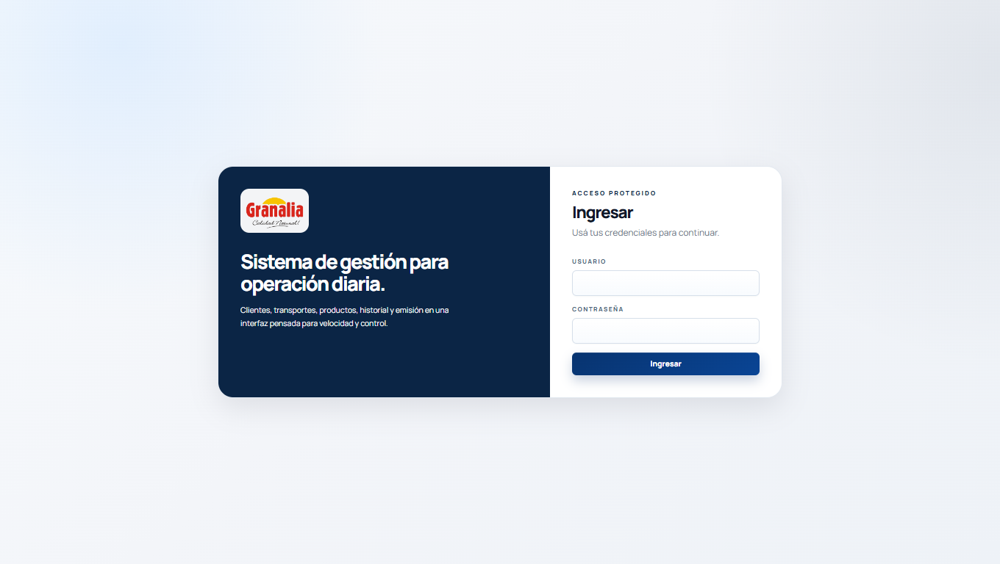

El acceso al sistema parte de una pantalla de login simple para operadores y administradores. Desde ahí se inicia una sesión protegida con cookie HTTP-only y token CSRF; el rol del usuario determina qué módulos puede ver y qué acciones sensibles puede ejecutar.

### Panel de gestión

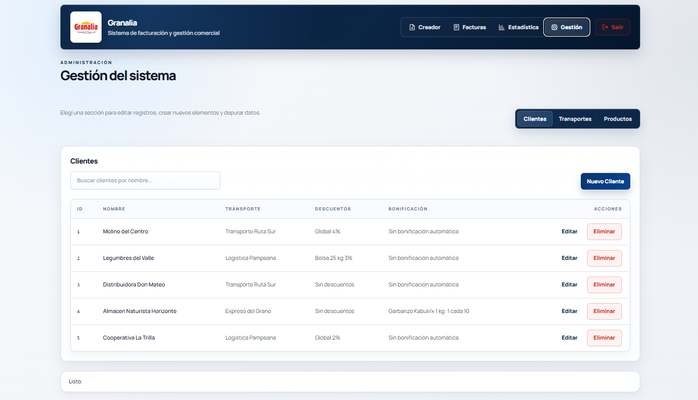

El panel de gestión centraliza los módulos operativos: clientes, productos, transportes, listas de precios, remitos, comprobantes fiscales, notas de crédito y estadísticas. La idea fue que el usuario no tenga que moverse entre planillas o herramientas externas para completar el circuito comercial.

### Administración de catálogos

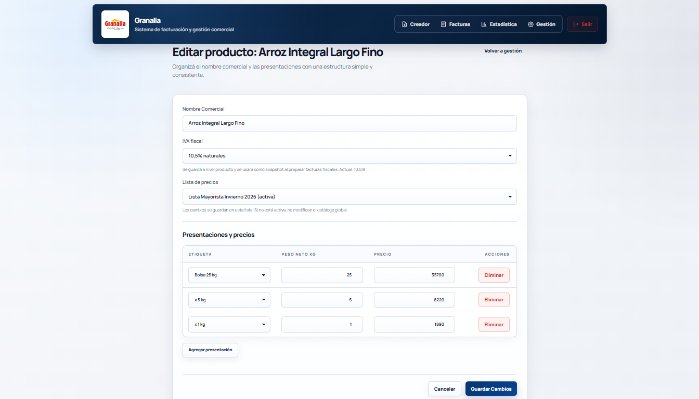

Las pantallas CRUD permiten mantener datos maestros como clientes, productos, presentaciones y transportes. Estos datos alimentan la carga de pedidos y quedan desacoplados de los remitos y comprobantes fiscales ya emitidos mediante snapshots históricos, para evitar que una modificación posterior altere documentos existentes.

### Carga y edición de listas de precios

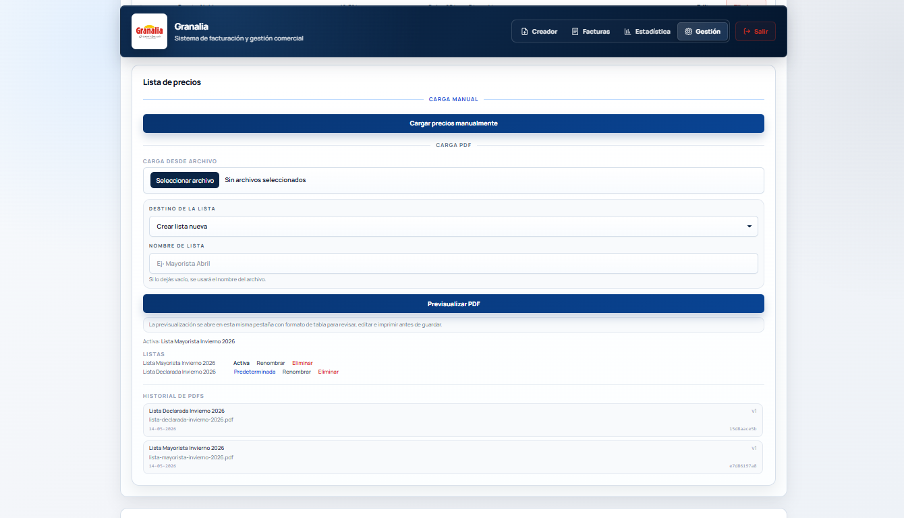

La carga de listas de precios permite subir archivos, revisar el contenido detectado y preparar una versión antes de activarla. Esto reduce errores de transcripción y mantiene trazabilidad sobre qué lista estaba vigente en cada operación.

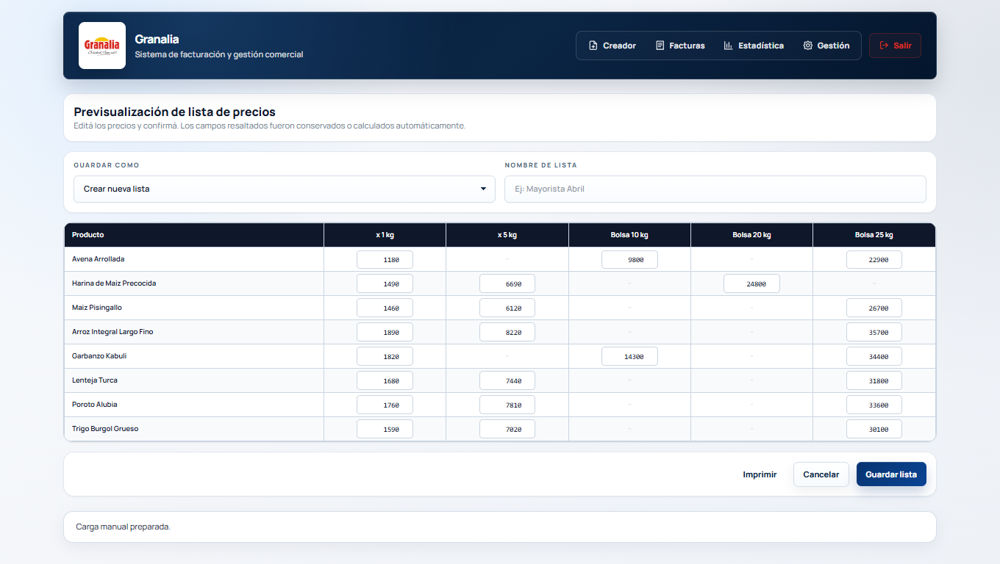

La edición de listas permite corregir precios, presentaciones o datos asociados antes de usar la versión en nuevos pedidos, remitos o comprobantes fiscales. El caso de uso está pensado para que administración pueda validar cambios comerciales sin tocar directamente los documentos históricos.

### Creación de comprobantes

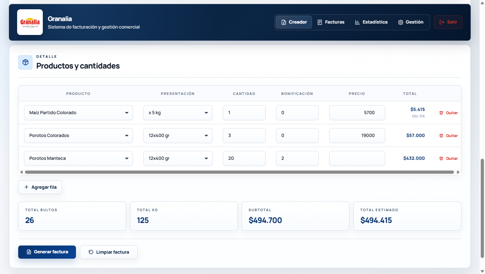

El creador de comprobantes concentra el flujo de pedido: selección de cliente, transporte, productos, cantidades, descuentos, bonificaciones y tipo de documento. Desde esta pantalla se resuelven remitos de gestión y, cuando corresponde, la emisión legal de facturas fiscales contra ARCA.

### Historial y detalle de comprobantes

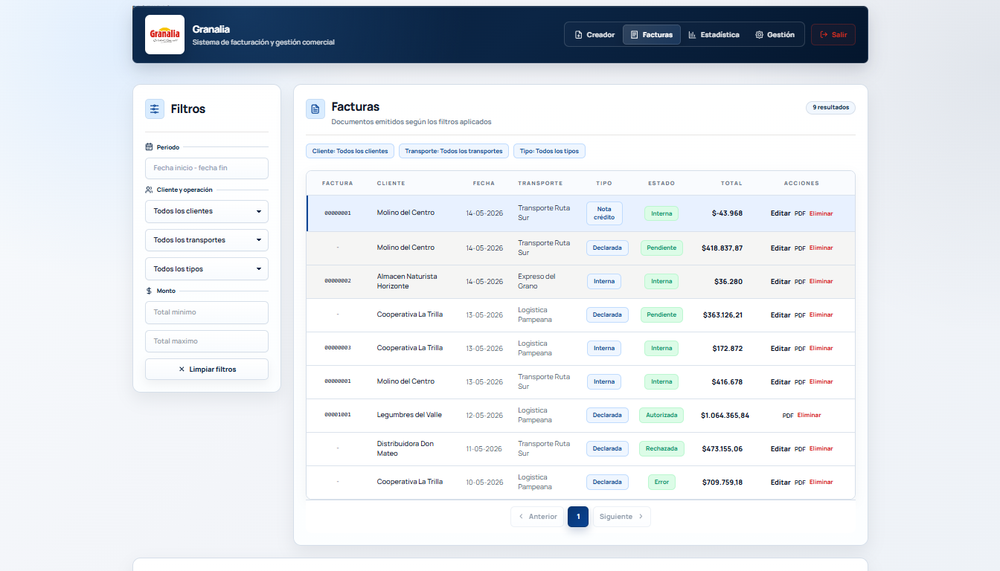

El listado de comprobantes funciona como historial operativo. Permite buscar remitos y documentos fiscales, revisar estados, descargar PDFs y acceder a acciones controladas según reglas de negocio, por ejemplo editar borradores o consultar facturas fiscales ya autorizadas.

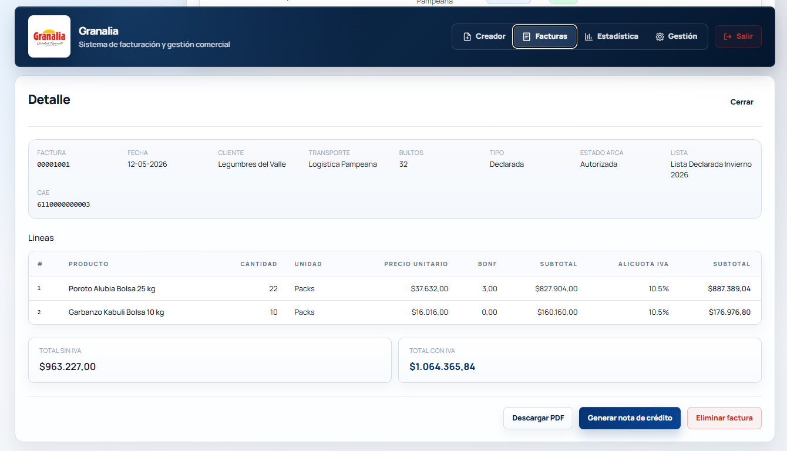

El detalle de comprobante muestra la composición completa del documento: cliente, transporte, ítems, totales y, si corresponde, datos fiscales y estado de autorización. Este caso de uso es clave para auditoría operativa, soporte comercial y verificación antes o después de emitir legalmente en ARCA.

### Estadísticas comerciales

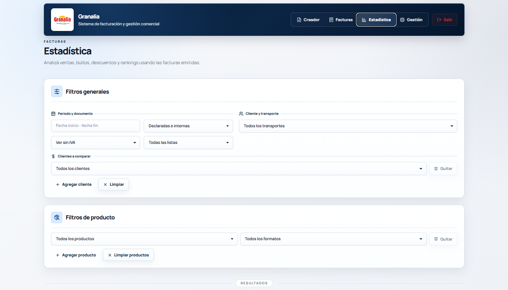

El módulo de estadísticas permite filtrar la información comercial por períodos y criterios operativos. Esta vista está restringida a administradores porque concentra indicadores sensibles del negocio.

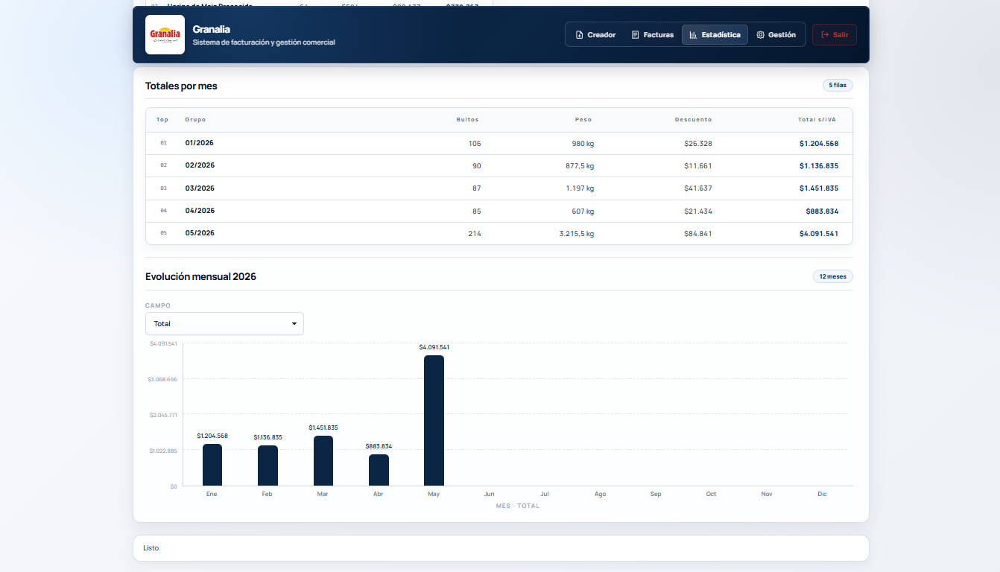

El resumen estadístico muestra métricas agregadas para entender volumen de ventas, comportamiento del período y resultados generales. La intención fue convertir datos transaccionales en información rápida para decisión comercial.

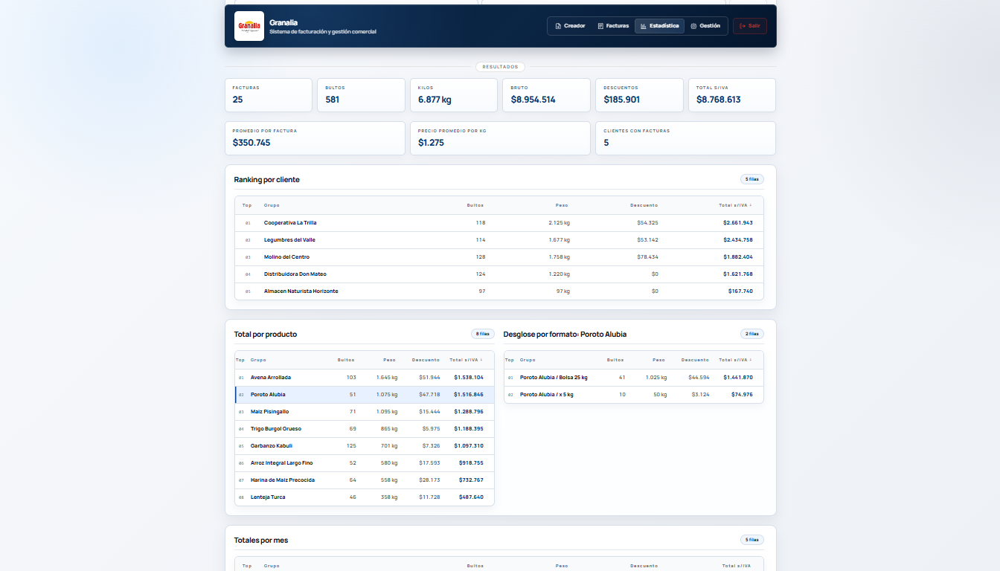

Los rankings ayudan a identificar productos, clientes o categorías con mayor peso dentro de la operación. Este caso de uso permite detectar tendencias sin exportar datos manualmente a una planilla.

## Integración con ARCA

La parte fiscal fue el mayor desafío técnico. El sistema implementa emisión de Factura A mediante WSFEv1, solicitando CAE a ARCA en producción.

Servicios utilizados:

- WSAA para autenticación con certificado, clave privada, ticket de acceso, token y sign.
- WSFEv1 para consultar puntos de venta, último comprobante, comprobantes existentes y solicitar CAE.
- Consulta de datos fiscales por CUIT para precargar información del contribuyente cuando el servicio está disponible y configurado.

El backend genera el login ticket request, firma la solicitud con certificado y clave privada, obtiene un ticket de acceso desde WSAA y luego usa `token` y `sign` para consumir WSFEv1. Esa separación mantiene aislado el flujo de autenticación fiscal respecto de la emisión del comprobante.

El flujo fiscal no autoriza automáticamente al guardar. Primero se crea una factura fiscal en borrador y luego un administrador ejecuta la acción sensible `Autorizar en ARCA`, protegida con contraseña adicional. Si ARCA responde correctamente, se persisten CAE, vencimiento de CAE, numeración fiscal, resultado y observaciones.

Las facturas fiscales autorizadas quedan bloqueadas. Esta decisión evita que un documento con validez fiscal pueda modificarse luego de haber recibido CAE.

## Manejo de errores fiscales

Una integración fiscal productiva no puede tratar todos los errores igual. El backend diferencia estados como ARCA deshabilitado, ARCA no configurado, rechazo fiscal, error técnico, timeout, error de red y conflicto de autorización.

La clasificación operativa distingue cuatro escenarios principales:

- Error de validación local: el sistema detecta datos incompletos o inconsistentes y no envía la solicitud a ARCA.
- Rechazo fiscal: ARCA responde, pero no autoriza el comprobante.
- Error técnico: no hay certeza de si ARCA llegó a procesar la solicitud, por ejemplo ante timeout o error de red.
- Autorización exitosa: ARCA devuelve CAE, vencimiento y número fiscal.

Ante errores técnicos o timeouts, el sistema consulta el último comprobante autorizado y, si corresponde, consulta el comprobante específico. Esto permite recuperar un CAE ya generado y evita reintentos inseguros que podrían duplicar comprobantes o romper la numeración fiscal.

También se auditan requests y responses en una tabla dedicada, pero con payloads sanitizados para no persistir secretos como token/sign ni claves privadas.

## Datos e integridad

La base usa PostgreSQL 16 con claves foráneas, constraints, índices únicos y JSONB para estructuras flexibles como descuentos, notas, reglas comerciales y snapshots.

Tablas relevantes:

- `app_users`.
- `customers`.
- `transports`.
- `products`.
- `product_offerings`.
- `price_lists` y `price_list_versions`.
- `catalogs`.
- `invoice_batches`.
- `invoices` e `invoice_items`.
- `invoice_tax_breakdown`.
- `invoice_sequences`.
- `credit_note_item_sources`.
- `arca_requests`.

Las decisiones de integridad más importantes fueron separar numeración de remitos y numeración fiscal, guardar snapshots históricos y representar estados explícitos para facturas fiscales: `draft`, `authorizing`, `authorized`, `rejected` y `error`.

## Seguridad

El sistema implementa medidas de seguridad de aplicación y de operación:

- Sesiones con cookies HTTP-only.
- Token CSRF.
- Roles `admin` y `operator`.
- Rutas protegidas en backend y frontend.
- Validaciones con Pydantic.
- Constraints en PostgreSQL.
- CORS configurable.
- Cookies seguras en producción.
- Validación estricta de secretos productivos.
- Contraseña adicional para autorización fiscal.
- Logging sin exposición de secretos.

## Infraestructura

El despliegue está preparado con Docker Compose, Caddy y PostgreSQL containerizado. Caddy sirve el frontend estático y actúa como reverse proxy hacia FastAPI. El backend expone health checks de vida y disponibilidad, logging estructurado y tiempos de respuesta por request mediante `X-Response-Time-Ms`.

## Resultado

Granalia es un caso de sistema full-stack con dominio real, reglas comerciales complejas, integración fiscal productiva y necesidades operativas concretas. El valor técnico estuvo en convertir un flujo manual en una aplicación mantenible, auditable y preparada para producción.

El aprendizaje principal fue diseñar software alrededor de invariantes de negocio: un documento histórico no debe cambiar, una factura fiscal autorizada no debe editarse, un timeout no debe duplicar numeración y una operación sensible debe ser explícita.
